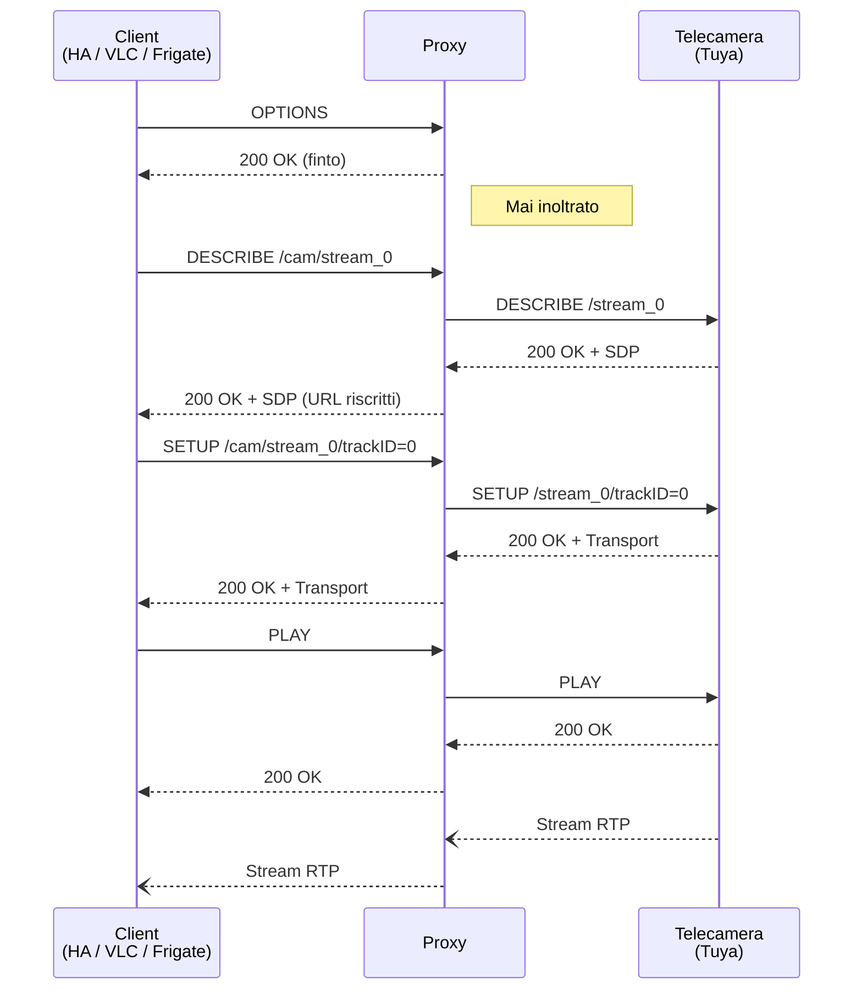

# Avent RTSP Proxy

[](https://github.com/thekoma/aventproxy/actions/workflows/ci.yml)

Proxy RTSP per baby monitor **Philips Avent** e altre **telecamere Tuya** che rifiutano le richieste RTSP `OPTIONS`.

## Il Problema

Molte telecamere basate su Tuya (incluso il Philips Avent SCD973/26) espongono un server RTSP sulla porta 554 che gestisce correttamente `DESCRIBE`, `SETUP` e `PLAY` — ma risponde `400 Bad Request` per `OPTIONS`. Siccome tutti i client RTSP standard (FFmpeg, GStreamer, VLC, Home Assistant) mandano `OPTIONS` per prima cosa, falliscono tutti.

## La Soluzione

Questo proxy si mette tra il tuo client RTSP e la telecamera. Intercetta le richieste `OPTIONS`, risponde con un finto `200 OK`, e inoltra tutto il resto in modo trasparente — incluso lo stream RTP.

## Aggiungi a Home Assistant

[](https://my.home-assistant.io/redirect/supervisor_add_addon_repository/?repository_url=https%3A%2F%2Fgithub.com%2Fthekoma%2Faventproxy)

1. Clicca il pulsante qui sopra (oppure vai in **Impostazioni → Add-on → Store Add-on → ⋮ → Repository** e aggiungi `https://github.com/thekoma/aventproxy`)
2. Installa **Avent RTSP Proxy**
3. Configura le tue telecamere nelle impostazioni dell'add-on
4. Avvia l'add-on

## Configurazione

```yaml
cameras:
  - name: "baby_monitor"
    host: "192.168.1.100"
    port: 554              # opzionale, default 554
  - name: "cameretta"
    host: "192.168.1.101"
bind_address: "0.0.0.0"   # 0.0.0.0 per Frigate, 127.0.0.1 solo locale
log_level: "info"          # debug | info | warning | error
```

Ogni telecamera ha il suo path nell'URL:

```
rtsp://<ip-addon>:8554/<nome-telecamera>/stream_0   # stream principale (1080p)
rtsp://<ip-addon>:8554/<nome-telecamera>/stream_1   # stream secondario
```

## Entità Camera in Home Assistant

```yaml
camera:
  - platform: generic
    stream_source: "rtsp://homeassistant.local:8554/baby_monitor/stream_0"
    name: "Baby Monitor"
```

## Integrazione con Frigate

Imposta `bind_address: "0.0.0.0"` nella configurazione dell'add-on, poi:

```yaml
cameras:
  baby_monitor:
    ffmpeg:
      inputs:
        - path: "rtsp://aventproxy:8554/baby_monitor/stream_0"
          roles: ["detect", "record"]
```

## Uso Standalone (senza Home Assistant)

```bash
# Singola telecamera
python -m proxy --camera baby:192.168.1.100:554 --bind 127.0.0.1 --port 8554

# Da file di configurazione
python -m proxy --config config.json

# Poi connettiti con qualsiasi client RTSP
ffplay rtsp://127.0.0.1:8554/baby/stream_0
```

### Formato file di configurazione

```json
{
  "cameras": [
    {"name": "baby_monitor", "host": "192.168.1.100", "port": 554}
  ],
  "bind_address": "127.0.0.1",
  "port": 8554,
  "log_level": "info"
}
```

## Come Funziona



## Sviluppo

```bash
pip install -e ".[dev]"
pytest -v
ruff check aventproxy/proxy tests
```

## Licenza

MIT
