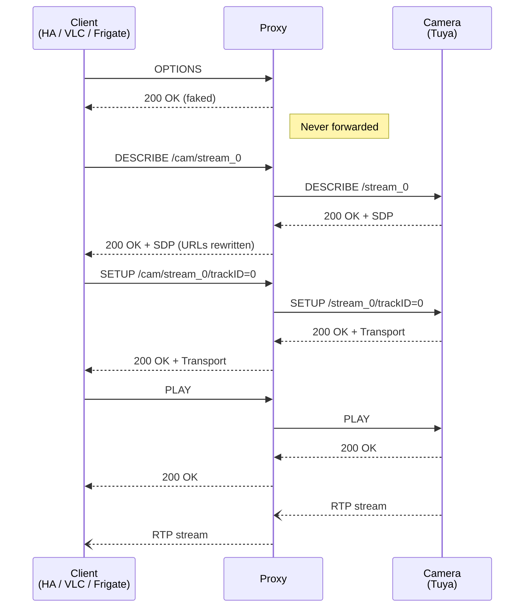

# Avent RTSP Proxy

[](https://github.com/thekoma/aventproxy/actions/workflows/ci.yml)

RTSP proxy for **Philips Avent** baby monitors and other **Tuya-based cameras** that reject standard RTSP `OPTIONS` requests.

## The Problem

Many Tuya-based cameras (including the Philips Avent SCD973/26) expose an RTSP server on port 554 that handles `DESCRIBE`, `SETUP`, and `PLAY` correctly — but returns `400 Bad Request` for `OPTIONS`. Since every standard RTSP client (FFmpeg, GStreamer, VLC, Home Assistant) sends `OPTIONS` first, they all fail.

## The Solution

This proxy sits between your RTSP client and the camera. It intercepts `OPTIONS` requests, returns a fake `200 OK`, and forwards everything else transparently — including the RTP data stream.

## Add to Home Assistant

[](https://my.home-assistant.io/redirect/supervisor_add_addon_repository/?repository_url=https%3A%2F%2Fgithub.com%2Fthekoma%2Faventproxy)

1. Click the button above (or go to **Settings → Add-ons → Add-on Store → ⋮ → Repositories** and add `https://github.com/thekoma/aventproxy`)
2. Install **Avent RTSP Proxy**
3. Configure your cameras in the add-on settings
4. Start the add-on

## Configuration

```yaml
cameras:
  - name: "baby_monitor"
    host: "192.168.1.100"
    port: 554              # optional, default 554
  - name: "nursery"
    host: "192.168.1.101"
bind_address: "0.0.0.0"   # 0.0.0.0 for Frigate, 127.0.0.1 for local only
log_level: "info"          # debug | info | warning | error
```

Each camera gets its own URL path:

```
rtsp://<addon-ip>:8554/<camera-name>/stream_0   # main stream (1080p)
rtsp://<addon-ip>:8554/<camera-name>/stream_1   # sub stream
```

## Home Assistant Camera Entity

```yaml
camera:
  - platform: generic
    stream_source: "rtsp://homeassistant.local:8554/baby_monitor/stream_0"
    name: "Baby Monitor"
```

## Frigate Integration

Set `bind_address: "0.0.0.0"` in the add-on config, then:

```yaml
cameras:
  baby_monitor:
    ffmpeg:
      inputs:
        - path: "rtsp://aventproxy:8554/baby_monitor/stream_0"
          roles: ["detect", "record"]
```

## Standalone Usage (without Home Assistant)

```bash
# Single camera
python -m proxy --camera baby:192.168.1.100:554 --bind 127.0.0.1 --port 8554

# From config file
python -m proxy --config config.json

# Then connect with any RTSP client
ffplay rtsp://127.0.0.1:8554/baby/stream_0
```

### Config file format

```json
{
  "cameras": [
    {"name": "baby_monitor", "host": "192.168.1.100", "port": 554}
  ],
  "bind_address": "127.0.0.1",
  "port": 8554,
  "log_level": "info"
}
```

## How It Works



## Development

```bash
pip install -e ".[dev]"
pytest -v
ruff check aventproxy/proxy tests
```

## License

MIT
